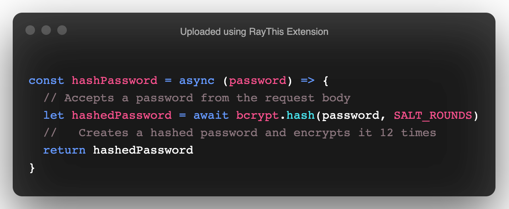
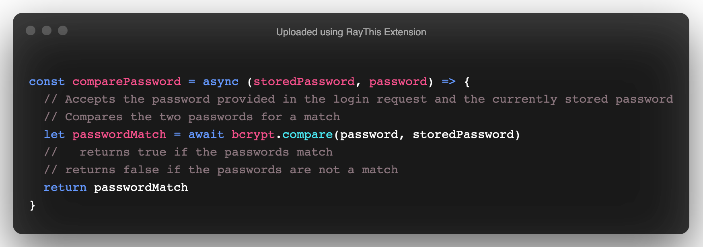
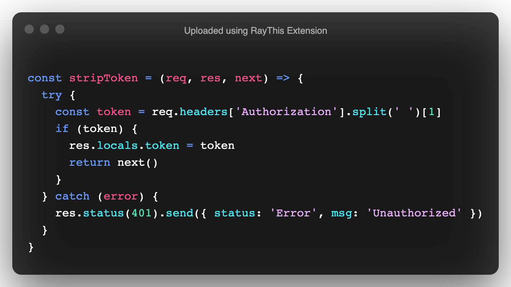
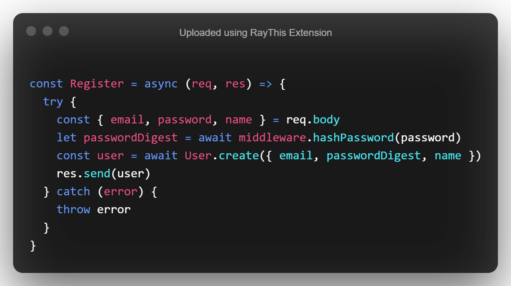
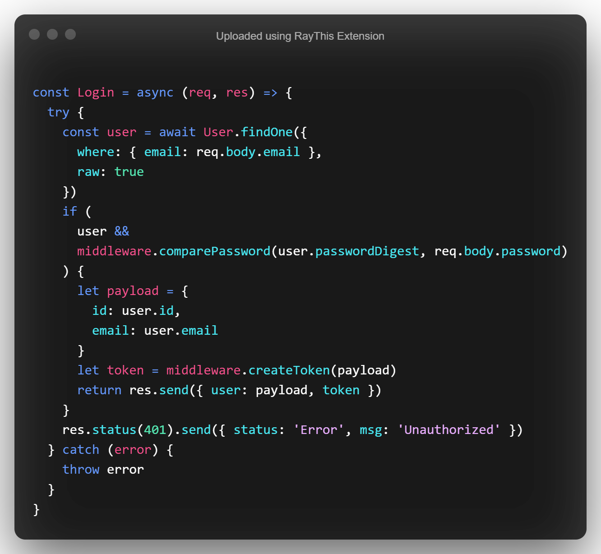
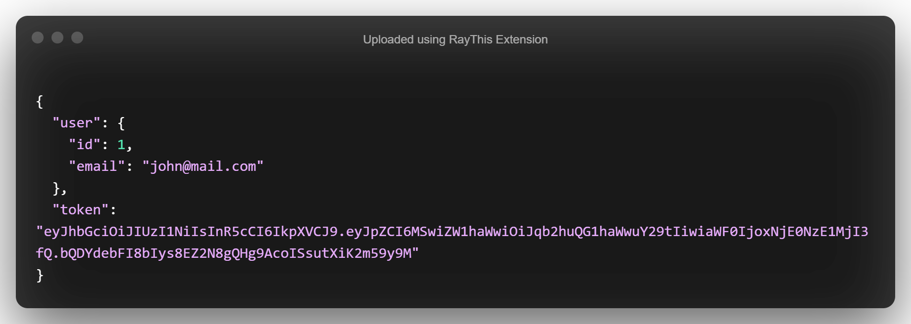
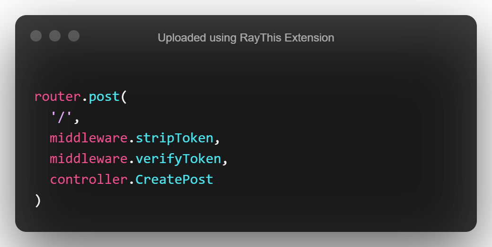
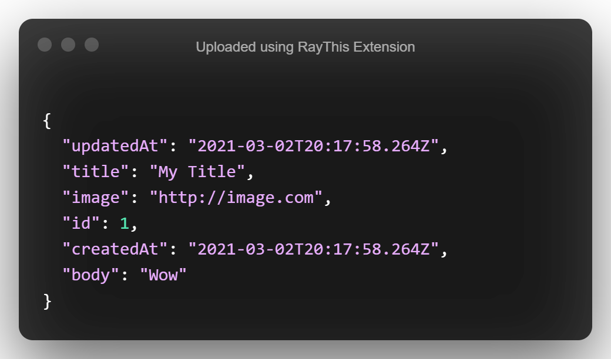

# Sequelize Authentication


## Overview

In this lesson, we'll learn to to integrate authentication into our express server. We'll implement password hashing, comparing, creating json web tokens, protecting routes and reading authorization credentials. Our api will allow users to `login`,`register` and protect certain endpoints from being accessed without being properly authorized.

## Getting Started

- Fork and Clone
- `npm install`
- `sequelize db:create`
- `sequelize db:migrate`
- `sequelize db:seed:all`
- `npm run dev`

## Creating Authentication/Authorization Middleware

We'll start by creating some middleware to handle our authentication and authorization flows. These functions will perform everything from hashing passwords to ensuring that a user is authorized to access a resource.

### Installing Necessary Dependencies

In order for our authentication/authorization middleware to work, we'll need some depedencies. Let's start by installing a few packages:

```sh
npm install bcrypt jsonwebtoken
```

#### **Bcrypt**

---

**[Bcrypt](https://github.com/kelektiv/node.bcrypt.js#readme)** is a dependency that we'll use to hash and compare credentials.

**You should never store plain text passwords in your database!**

We'll utilize two methods from this library:

- `bcrypt.hash()`
- `bcrypt.compare()`

#### **Jsonwebtoken**

---

**[JsonWebToken](https://github.com/auth0/node-jsonwebtoken)** is a dependency that will allow us to generate and verify `JWT` tokens. `JWT` tokens are encrypted strings that store some identifying information about a user. **Never store sensitive information about a user in these tokens!**

### Creating Our Middleware

Create a `middleware` folder in this project:

```sh
mkdir middleware
```

In the newly created `middleware` folder, create an `index.js` file:

```sh
touch middleware/index.js
```

Start by requiring the necessary packages, we'll need `bcrypt` and `jsonwebtoken`:

```js
const bcrypt = require('bcrypt')
const jwt = require('jsonwebtoken')
```

Next we need to create some variables in order to tell `bcrypt` how complex we want the hash to be for a password and a secret that will sign our `JWT` tokens.

Add the following to `middleware/index.js`

```js
const SALT_ROUNDS = 12
const APP_SECRET = 'supersecretkey'
```

`SALT_ROUNDS` is how complex the hash will be for our passwords, `12` is a good number because it would take even super computers years to crack.

`APP_SECRET` is the secret key we'll use to sign our `JWT` tokens.

**THESE VARIABLES SHOULD ALWAYS BE STORED IN A `.env` FILE**

When storing these variables in a `.env` file, you'll need to convert `SALT_ROUNDS` to an integer.

#### Hashing Passwords

> **The functions necessary will provided followed by a breakdown of how each function operates**

---

Start by creating a password hashing function:

```js
const hashPassword = async (password) => {
  let hashedPassword = await bcrypt.hash(password, SALT_ROUNDS)
  return hashedPassword
}
```



We're using `async/await` because the hashing process takes some time to complete to we need to tell javascript to wait for it to finish.

#### Comparing Passwords

---

Create a password comparing function:

```js
const comparePassword = async (storedPassword, password) => {
  let passwordMatch = await bcrypt.compare(password, storedPassword)
  return passwordMatch
}
```



#### Creating `JWT` Tokens

Add a function called `createToken`:

```js
const createToken = (payload) => {
  let token = jwt.sign(payload, APP_SECRET)
  return token
}
```


#### Verifying `JWT` Tokens

---

Add a function called `verifyToken`:

```js
const verifyToken = (req, res, next) => {
  const { token } = res.locals
  try {
    let payload = jwt.verify(token, APP_SECRET)
    if (payload) {
      return next()
    }
    res.status(401).send({ status: 'Error', msg: 'Unauthorized' })
  } catch (error) {
    res.status(401).send({ status: 'Error', msg: 'Unauthorized' })
  }
}
```


**_Here's a few questions you may want to ask yourselves:_**

- _Why are we all of a sudden passing in `req,res,next`?_
- _Where may the functions with `req,res,next` be used during a request?_

#### Reading Tokens

---

Add a function called `stripToken`:

```js
const stripToken = (req, res, next) => {
  try {
    const token = req.headers['Authorization'].split(' ')[1]
    if (token) {
      res.locals.token = token
      return next()
    }
  } catch (error) {
    res.status(401).send({ status: 'Error', msg: 'Unauthorized' })
  }
}
```



### Bundling Our Functions

Now that we've written out all of our functions, it's time to export them:

```js
module.exports = {
  stripToken,
  verifyToken,
  createToken,
  comparePassword,
  hashPassword
}
```

We've finished writing out all of our authentication/authorization middleware. Next we'll utilize these functions to perform actions during a request.

## Hashing Passwords

Open the `AuthController.js` file.

You'll notice, that there are two functions already written for you:

```js
const { User } = require('../models')

const Login = async (req, res) => {
  try {
  } catch (error) {
    throw error
  }
}

const Register = async (req, res) => {
  try {
  } catch (error) {
    throw error
  }
}

module.exports = {
  Login,
  Register
}
```

### Building Out Registration

We'll start with building out the functionality for registration.

We first need to require our authentication/authorization middleware:

```js
const middleware = require('../middleware')
```

Next we'll work in the `Register` function:

- We'll start by pulling the necessary fields from the request body:
  ```js
  const { email, password, name } = req.body
  ```
- Next we'll hash the provided password:
  ```js
  let passwordDigest = await middleware.hashPassword(password)
  ```
- Now we want to create a user utilizing the extracted fields and the newly created `passwordDigest`:
  ```js
  const user = await User.create({ email, passwordDigest, name })
  ```
- Finally we'll send the newly created user as a response:
  ```js
  res.send(user)
  ```

The final `Register` function:



#### Testing The Register Functionality

---

Start your server:

```sh
npm run dev
```

Open `Insomnia` and create a `POST` request to `http://localhost:3001/auth/register`. Create a `JSON` request body with the following fields:

```json
{
  "name": "string",
  "email": "string",
  "password": "string"
}
```

Submit the request and you should receive a similar response:


### Building Out Login Functionality

Next we'll build out the functionality for `Login`.

Open `AuthController.js`

We'll be working in the `Login` function:

- First we'll find a user by email, emails are set to `unique` so that the database protects against duplicate entries
  ```js
  const user = await User.findOne({
    where: { email: req.body.email },
    raw: true
  })
  ```
- We'll check if the user exists and if the stored password and provided password are the same
  ```js
  if (
    user &&
    (await middleware.comparePassword(user.passwordDigest, req.body.password))
  ) {
    // Next code goes here
  }
  ```
- If the condition is met, we'll create a payload for our `JWT` token
  ```js
  let payload = {
    id: user.id,
    email: user.email
  }
  ```
- We'll create the token and send back a response with the payload and token
  ```js
  let token = middleware.createToken(payload)
  return res.send({ user: payload, token })
  ```
  **Remember, never store sensitive user information in the token!**
- If the user does not exist or the passwords don't match, we'll send back a `401` status code and an `unauthorized` message. This should be the final line in your `try` block, outside of the `if` statement.
  ```js
  res.status(401).send({ status: 'Error', msg: 'Unauthorized' })
  ```

Here's the final `Login` function:



#### Testing The Login Functionality

---

Open `Insomnia` again, this time we'll send a `POST` request to `http://localhost:3001/auth/login`

You can leave the `request body` the same as the `Register`. Submit the request and you should receive a similar response:



### Protecting Routes

Just because our users can login and register, does not mean our data is secure, we need a way to protect certain routes from unauthorized users.

Open the `routes/PostRouter.js` file.

Start by requiring our middleware:

```js
const middleware = require('../middleware')
```

We'll start with the `POST` route, we want to ensure that users are authorized to submit new posts:

- After the path, pass in the `stripToken` method
  ```js
  middleware.stripToken,
  ```
- Now if the request passes the first middleware, we want to verify that the token is legitimate and untampered
  ```js
  middleware.verifyToken,
  ```
  The final `router.post`:



Let's test this endpoint.

Open `Insomnia` and submit a `POST` request to `http://localhost:3001/posts`

The request body should be the following:

```json
{
  "title": "string",
  "body": "string",
  "image": "string"
}
```

Submit the request and you should receive the following response:


Looks like our middleware is doing it's job!

Let's update our request to have an authorization header.

#### Adding Auth Headers

---

Submit a login request with the user you created previously.

Copy the generated token and select the `auth` tab in `Insomnia`.

Select the `Bearer Token` option from the dropdown.

Paste your token into the `Token` field

Add the following to the `Prefix` field: `Bearer`

Resubmit your `POST` request to `http://localhost:3001/posts`

You should receive a similar response:



## You Do

- Implement the authorization middleware for the `PUT` and `DELETE` routes for posts. These routes must be protected from unauthorized access.
- Create a route to update a users password.
  - Think about how other sites do this functionality
  - Think about what fields should be required

## Recap

In this lesson, we learned how to implement and build Authorization/Authentication middleware. We protected sensitive routes from unauthorized access and added registration and login functionality.

## Resources

- [JsonWebToken](https://github.com/auth0/node-jsonwebtoken)
- [Bcrypt](https://github.com/kelektiv/node.bcrypt.js#readme)
- [Authentication Vs Authorization](https://medium.datadriveninvestor.com/authentication-vs-authorization-716fea914d55)
